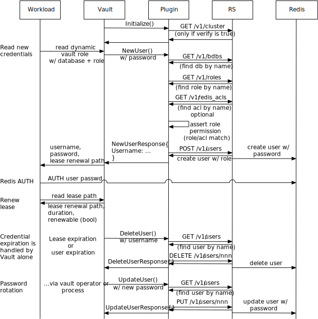
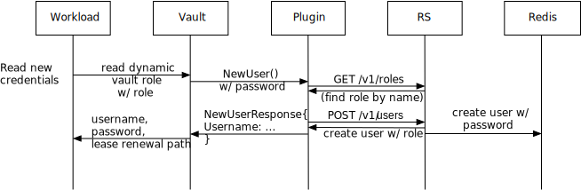

# Vault Database Secrets Engine - Redis Enterprise Plugin

A Redis Enterprise plugin for the HashiCorp Vault Database Secrets Engine.

## Overview

This plugin supports:

 * database users via a role bound in the database
 * database users with a specific Redis ACL
 * cluster-wide users with access to multiple databases.

A **database user with a role** provides access by generating a user
using an existing role bound to an ACL in the database. This enables role-based
modeling of database users without actually creating the users. The plugin
will manage the user lifecycle.

A **database user with an ACL** provides access by creating a new role
and role binding in the database. This is the most dynamic and requires no
configuration by the administrator except when a new ACL is required to be
created. **This may conflict with operator-managed role bindings for a database.**
This feature is turned off by default and must be enabled.

A **cluster user** are provided access to databases by the role
of the user. No database is specified in the configuration. If the role is
bound in a particular database, the user has capabilities in that database. This
binding in the database is controlled by the cluster administrator and
not the plugin. This allows the generated user to access more than one database.

In all cases, the user is created dynamically and deleted when it expires.

## Service & plugin request flows

### Database Roles

The complete lifecycle of the plugin and its relationship to the workload,
Redis Enterprise, and the Redis database instance are as follows:

It should be noted that Vault is responsible for detecting the expiration of
the user. When it does so, it will invoke the plugin to delete the user. The
application workload is unaware of this expiration and must re-read the
database role to generate a new set of credentials. This same scenario happens
when the lease expires.

### Cluster Role

A cluster role does not have a database associated with the vault role. In
this scenario, only the user creation is different from the database role.

### Database ACL

When only the database and ACL is specified, a role must be generated for the
user and deleted when the user is deleted. This changes the user creation and
deletion but the rest is the same as the database role.

It should be noted that the plugin updates the role_permissions aspect of
the database definition. This conflicts with the Redis Enterprise Operator,
which also maintains role_permissions, and so this cannot be used with the
operator.

## Kubernetes deployment

The Vault sidecar injector and the plugin can work together to provide
workloads access to databases via short-lived users and credentials. See
the [Using the plugin on K8s](k8s/README.md) for a guide to to deploying and
testing access to Redis Enterprise databases on Kubernetes.
