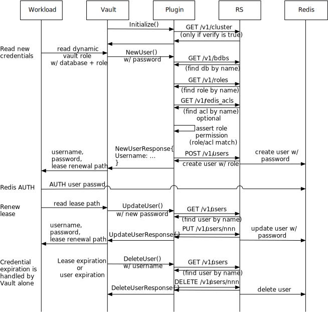
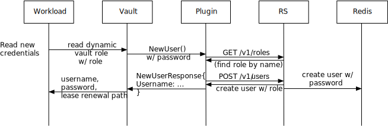
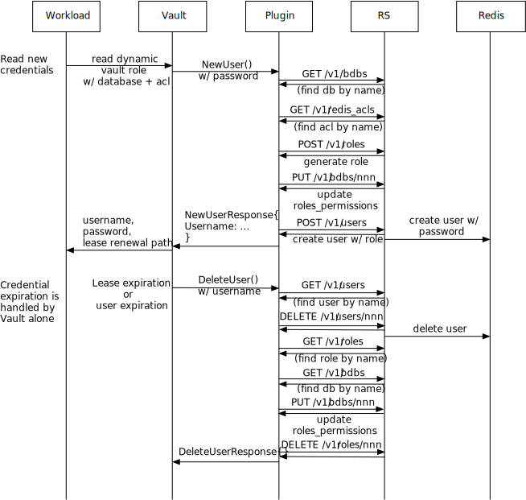

# vault-plugins
HashiCorp Vault Plugins for Redis Enterprise

## Overview

This plugin supports:

 * database users via a role bound in the database
 * database users with a specific Redis ACL
 * cluster-wide users with access to multiple databases.

A **database user with a role** provides access by generating a user
using an existing role bound to an ACL in the database. This enables role-based
modeling of database users without actually creating the users. The plugin
will manage the user lifecycle.

A **database user with an ACL** provides access by creating a new role
and role binding in the database. This is the most dynamic and requires no
configuration by the administrator except when a new ACL is required to be
created. **This may conflict with operator-managed role bindings for a database.**

A **cluster user** are provided access to databases by the role
of the user. No database is specified in the configuration. If the role is
bound in a particular database, the user has capabilities in that database. This
binding in the database is controlled by the cluster administrator and
not the plugin. This allows the generated user to access more than one database.

In all cases, the user is created dynamically and deleted when it expires.

## Building the plugin

```
go build
gox -osarch="linux/amd64" ./...
```

The plugin architecture must be for the target vault architecture. If you are
running via docker, this is likely `linux/amd64`.

## Testing the plugin

You you need a Redis Enterprise REST API endpoint and cluster administrator
username and password to run the tests. In general, the tests require a few
environment variables and can be run as follows:

```
export RS_API_URL=...
export RS_USERNAME=...
export RS_PASSWORD=...
go test
```

The tests require:

 * a locally accessible endpoint for Redis Enterprise REST API
 * a database called `mydb`

The setup for testing is as follows:

1. At minimum, the vault plugin needs to access the REST API of a Redis Enterprise
   cluster. The [Redis Enterprise operator for Kubernetes](https://docs.redislabs.com/latest/platforms/kubernetes/)
   can easily be installed on a variety of target distributions. You can
   follow the [install procedure](https://github.com/RedisLabs/redis-enterprise-k8s-docs#installation)
   to install the operator bundle into a namespace.

1. A very small test cluster can be established by:

   ```
   cat << EOF > test-cluster.yaml
   apiVersion: app.redislabs.com/v1
   kind: RedisEnterpriseCluster
   metadata:
     name: test
   spec:
     nodes: 3
     redisEnterpriseNodeResources:
       limits:
         cpu: 1000m
         memory: 3Gi
       requests:
         cpu: 1000m
         memory: 3Gi
   EOF
   kubectl apply -f test-cluster.yaml
   ```

1. The cluster will bootstrap and you can check the status with:

   ```
   kubectl get rec/test -o=jsonpath={.status.state}
   ```

1. Once the status is `Running`, you can port forward the REST API to your local
   machine for testing:

   ```
   kubectl port-forward service/test 9443
   ```

1. The end point for testing is now `https://localhost:9443/` and the credentials
   are stored in the secret with the same name of the cluster (`secret/test`):

   ```
   export RS_API_URL=https://localhost:9443/
   export RS_USERNAME=`kubectl get secret/test -o=jsonpath={.data.username} | base64 -d`
   export RS_PASSWORD=`kubectl get secret/test -o=jsonpath={.data.password} | base64 -d`
   ```

1. The tests require a database to be setup:

   ```
   cat << EOF > mydb-100mb-db.yaml
   apiVersion: app.redislabs.com/v1alpha1
   kind: RedisEnterpriseDatabase
   metadata:
     name: mydb
   spec:
     memory: 100MB
     rolesPermissions:
     - type: redis-enterprise
       role: "DB Member"
       acl: "Not Dangerous"
   EOF
   kubectl apply -f mydb-100mb-db.yaml
   ```

The tests should now work against the cluster:

```
go test
```

## Setup

### Run a local Vault

In your build directory for the plugin, run Vault so that it has access to the
plugin binary:

```
docker run --rm --cap-add=IPC_LOCK -e 'VAULT_DEV_ROOT_TOKEN_ID=xyzzyxyzzy' -v `pwd`:/etc/vault/plugins -e 'VAULT_LOCAL_CONFIG={"plugin_directory":"/etc/vault/plugins"}' vault
```

### Configure the plugin

From your build directory, calculate the sha256 checksum:

```
shasum -a 256 vault-plugin-database-redisenterprise_linux_amd64 | cut -d' ' -f1
```

Now, attach to the running Vault container:

```
VAULT_NAME=`docker ps -f ancestor=vault --format "{{.Names}}"`
docker exec -it $VAULT_NAME sh
```

In the shell, setup the local Vault authentication:

```
export VAULT_TOKEN=$VAULT_DEV_ROOT_TOKEN_ID
export VAULT_ADDR=http://127.0.0.1:8200
```

Using the sha256 that you calculated above, modify this command to
register the plugin:

```
vault write sys/plugins/catalog/database/redisenterprise-database-plugin command=vault-plugin-database-redisenterprise_linux_amd64 sha256=...
```

Finally, enable the database secrets engine:

```
vault secrets enable database
```

At this point, you can configure database roles for Redis Enterprise.

### Configure a database:

The following will config a Vault configuration of a Redis database called `mydb`. Note
that the `allow_roles` specifies the Vault role names and not the Redis user role. In
this example, we have enabled all vault roles with a wildcard.

Using the defaults for a cluster setup, there is a cluster administrator account
in the kubernetes secret for the cluster. You can retrieve these by:

```
kubectl get secret/test -o=jsonpath={.data.username} | base64 -d
kubectl get secret/test -o=jsonpath={.data.password} | base64 -d
```

Use these values to configure a database, replacing the `...` at the end with
the username and password, respectively:

```
vault write database/config/redis-mydb plugin_name="redisenterprise-database-plugin" url="https://host.docker.internal:9443" allowed_roles="*" database=mydb username=... password=...
```


### Configure database user role

A user is associated with a role binding in the database. You must either
reference a currently configured role binding or a Redis ACL.

The preferred and simplest method is to use a role that is already bound
in your database. This role binding can be defined via the K8s database
controller or via the administrative user interface. This avoids having
the plugin manage database role bindings that may conflict with other
operations management (e.g., the K8s database controller).

If you want to use a role that is bound in your database:

```
vault write database/roles/mydb db_name=redis-mydb creation_statements="{\"role\":\"DB Member\"}" default_ttl=3m max_ttl=5m
```

This will create a user using the reference role. If the role is not bound in
the database to an ACL, it is an error. If you also specify an ACL, the plugin
will assert that the ACL specified and the binding are the same. For example:

```
vault write database/roles/mydb-role-acl db_name=redis-mydb creation_statements="{\"role\":\"DB Member\",\"acl\":\"Not Dangerous\"}" default_ttl=3m max_ttl=5m
```

It is an error if the role does not have the same binding to the same ACL in the database.

If you specify only a Redis ACL, a role and role binding in the database
will be generated:

```
vault write database/roles/mydb-acl db_name=redis-mydb creation_statements="{\"acl\":\"Not Dangerous\"}" default_ttl=3m max_ttl=5m
```

In this configuration, the user credentials returned will be bound to a new role
bound to the requested ACL in the database.

In both situations, a new user is generated and associated with the role used or
generated.

A role binding in a database is never generated when using an existing role as this would
allow escalation of privileges in the database for others users with the same role.

### Configuring a cluster user role

A cluster user has access to whatever database the associated role has been
given by the administrator. This may be a single database with a specific
ACL or multiple databases with different ACLs. The plugin does not manage
the role bindings and does not update the `roles_permissions` on the
database.

To configure a database that allows any database, just omit the `database`
parameter:

```
vault write database/config/redis-test plugin_name="redisenterprise-database-plugin" url="https://host.docker.internal:9443" allowed_roles="*" username="demo@redislabs.com" password=...
```

When you create the Vautl role for the user, you must specify a database role
(Redis ACLs are not allowed):

```
vault write database/roles/test db_name=redis-test creation_statements="{\"role\":\"DB Member\"}" default_ttl=3m max_ttl=5m
```

### Reading credentials

Once the Vault role is configured, a workload can create a new credential by just
reading the Vault role:

```
vault read database/creds/mydb
```

The result is similar to:

```
Key                Value
---                -----
lease_id           database/creds/mydb/zgVJfei8P0Tw7cKX3g9Hx89l
lease_duration     3m
lease_renewable    true
password           ZWI87ddZMPR7hR8U-3sJ
username           vault-mydb-69dea4c9-4da8-4e34-bf93-eebf60095766
```

A workload can renew the password before the lease expires up to the maximum expiry:

```
vault lease renew database/creds/test/zgVJfei8P0Tw7cKX3g9Hx89l
```

A lease renewal changes the password for the user.

If the lease expires or the maximum expiry is reached, the user is revoked by
Vault. When the user is revoked, the plugin will delete the user and all
the corresponding create items (i.e., the role, binding, and user) are deleted.

Note that the `roles_permissions` on the database will be updated during this process.

### Using credentials

The username and password can be directly used in the Redis `AUTH` command:

```
AUTH vault-mydb-69dea4c9-4da8-4e34-bf93-eebf60095766 ZWI87ddZMPR7hR8U-3sJ
```

On a test cluster, you can forward the database port:

```
kubectl port-forward service/mydb `kubectl get service/mydb -o=jsonpath="{.spec.ports[0].targetPort}"`
```

Use the `redis-cli` to connect and authenticate:

```
redis-cli -p `kubectl get service/mydb -o=jsonpath="{.spec.ports[0].targetPort}"` --user vault-mydb-942fb9fe-f5c7-49d9-bce2-151c4c3c5343 --pass bxp-8GDDdZrDpbRfDzxg
```

where the username and password are the credentials returned by vault.

## Service & plugin request flows

### Database Roles

The complete lifecycle of the plugin and its relationship to the workload,
Redis Enterprise, and the Redis database instance are as follows:



It should be noted that Vault is responsible for detecting the expiration of
the user. When it does so, it will invoke the plugin to delete the user. The
application workload is unaware of this expiration and must re-read the
database role to generate a new set of credentials. This same scenario happens
when the lease expires.

### Cluster Role

A cluster role does not have a database associated with the vault role. In
this scenario, only the user creation is different from the database role.



### Database ACL

When only the database and ACL is specified, a role must be generated for the
user and deleted when the user is deleted. This changes the user creation and
deletion but the rest is the same as the database role.



It should be noted that the plugin updates the role_permissions aspect of
the database definition. This conflicts with the Redis Enterprise Operator,
which also maintains role_permissions, and so this cannot be used with the
operator.

## Kubernetes deployment

The Vault sidecar injector and the plugin can work together to provide
workloads access to databases via short-lived users and credentials. See
the [Using the plugin on K8s](k8s/README.md) for a guide to to deploying and
testing access to Redis Enterprise databases on Kubernetes.
